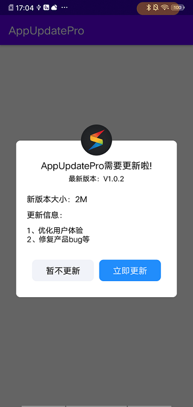
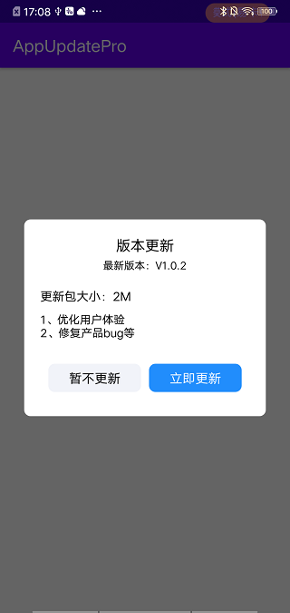

# AppUpdater

一个简单方便的App版本更新库，适配AndroidN与O，简单接入，支持网络请求自定义，支持版本信息显示自定义等。

使用：

1、添加依赖：

```
implementation project(":sk_appupdate")
```

2、初始化（传入版本信息地址/接口）：

```
SkAppUpdater.init(this)
        .setUpdateUrl("https://smark-file.oss-cn-shanghai.aliyuncs.com/updateApp/json_test.txt"));
```

3、使用：

​	1、静默版本检测：

​	SkAppUpdater.checkUpdate(MainActivity.this, SkAppUpdater.SILENT_CHECK);

​	2、手动版本检测：

​	SkAppUpdater.checkUpdate(MainActivity.this, SkAppUpdater.INITIATIVE_CHECK);

4、更新数据模板：

{
  "new_version": "1.0.2",
  "new_version_code": "2",
  "apk_file_url": "https://smark-file.oss-cn-shanghai.aliyuncs.com/updateApp/newApp.apk",
  "update_log": "1、优化用户体验\n2、修复产品bug等",
  "target_size": "2M",
  "new_md5":"fc9b5152cbd56f896123e3f08fe5a4db",
  "constraint": false
}

new_version：版本名

new_version_code：版本号

apk_file_url：新的apk下载地址

update_log：更新日志

target_size：更新包大小

new_md5：新包的md5值，用来做更新安全校验，


至此版本更新接入完成。so easy！！！


只有这些功能？更新提示页面样式太丑了，怎么办？往下看：

本版本库提供自带两种UI样式：SimpleNotifyDialog和CustomNotifyDialog；当然也支持自定义UI样式，只需继承BaseUpdateDialog便可以啦，然后在初始化的时候设置下自己自定义的DialogUI便可以啦，具体如下：

自定义Dialog案例：

```
public class SimpleNotifyDialog extends BaseUpdateDialog {
    private static final String TAG = "SimpleNotifyDialog";


    @Override
    protected int getLayoutId() {
        return R.layout.simple_dialog_layout;
    }

    @Override
    protected BaseUpdateDialog getCustomDialog() {
        return new SimpleNotifyDialog();
    }


    @Override
    protected void bindView(View view) {

        TextView new_version_name = view.findViewById(R.id.new_version_name);
        TextView size = view.findViewById(R.id.size);
        TextView content = view.findViewById(R.id.content);
        final TextView cancer = view.findViewById(R.id.cancer);
        final TextView update = view.findViewById(R.id.update);

        if (mUpdateInfoBean != null) {
            new_version_name.setText(String.format("最新版本：V%s", mUpdateInfoBean.getNew_version()));
            size.setText(String.format("更新包大小：%s", mUpdateInfoBean.getTarget_size()));
            content.setText(mUpdateInfoBean.getUpdate_log());
            if (mUpdateInfoBean.isConstraint()) {
                cancer.setVisibility(View.GONE);
            } else {
                cancer.setVisibility(View.VISIBLE);
            }
        }
        cancer.setOnClickListener(new View.OnClickListener() {
            @Override
            public void onClick(View v) {
                dismiss();
            }
        });
        update.setOnClickListener(new View.OnClickListener() {
            @Override
            public void onClick(final View v) {
                v.setEnabled(false);
                update.setText("更新中...");
                cancer.setVisibility(View.GONE);
                File apkFile = new File(getActivity().getCacheDir(), "target.apk");
                SkAppUpdater.getINetManager().downloadApk(mUpdateInfoBean.getApk_file_url(), apkFile, new INetDownloadCallBack() {
                    @Override
                    public void success(File apkFile) {
                        v.setEnabled(true);
                        dismiss();
                        String fileMd5 = AppUtil.getApkMd5(apkFile);
                        Log.e(TAG, "newApkMd5: " + fileMd5);
                        if (fileMd5 != null && fileMd5.equalsIgnoreCase(mUpdateInfoBean.getNew_md5())) {
                            AppUtil.installApp(getActivity(), apkFile);
                        } else {
                            Toast.makeText(getActivity(), "安装包校验未通过，更新失败!", Toast.LENGTH_SHORT).show();
                        }
                    }

                    @Override
                    public void progress(int progress) {
                        update.setText(String.format("%d%%", progress));
                    }

                    @Override
                    public void failed(Throwable e) {
                        v.setEnabled(true);
                        e.printStackTrace();
                        dismiss();
                        Toast.makeText(getActivity(), "更新失败!", Toast.LENGTH_SHORT).show();
                    }
                }, SimpleNotifyDialog.this);
            }
        });

    }


}
```

怎么使用呢？

初始化的时候传进去就行：

```
SkAppUpdater.init(this)
        .setUpdateUrl("https://smark-file.oss-cn-shanghai.aliyuncs.com/updateApp/json_test.txt")
        .setCustomDialog(new SimpleNotifyDialog());
```


我项目中有网络请求，不想用自带的怎么办？

答：自定义！

库中自带的是使用okhttp封装的请求实现类：OkHttpNetManager，如果不想使用的话可以实现INetManager接口，定义自己的网络请求工具便可以！

自定义的在初始化中通过setINetManager方法便可以完美替换啦！


**注意**：使用时需自己进行一些  Android N/O适配：

在Manifest中加入：

```
<provider
    android:name="androidx.core.content.FileProvider"
    android:authorities="${applicationId}.fileprovider"
    android:exported="false"
    android:grantUriPermissions="true" >
    <meta-data android:name="android.support.FILE_PROVIDER_PATHS"
        android:resource="@xml/fileproviderpath">
    </meta-data>
</provider>
```

同时在res/xml中新建fileproviderpath.xml文件：

内容：

```
<?xml version="1.0" encoding="utf-8"?>
<network-security-config>
    <base-config cleartextTrafficPermitted="true"></base-config>
</network-security-config>
```

在Manifest中加入权限：

```
<uses-permission android:name="android.permission.REQUEST_INSTALL_PACKAGES">
```

说了半天效果啥样呢？



